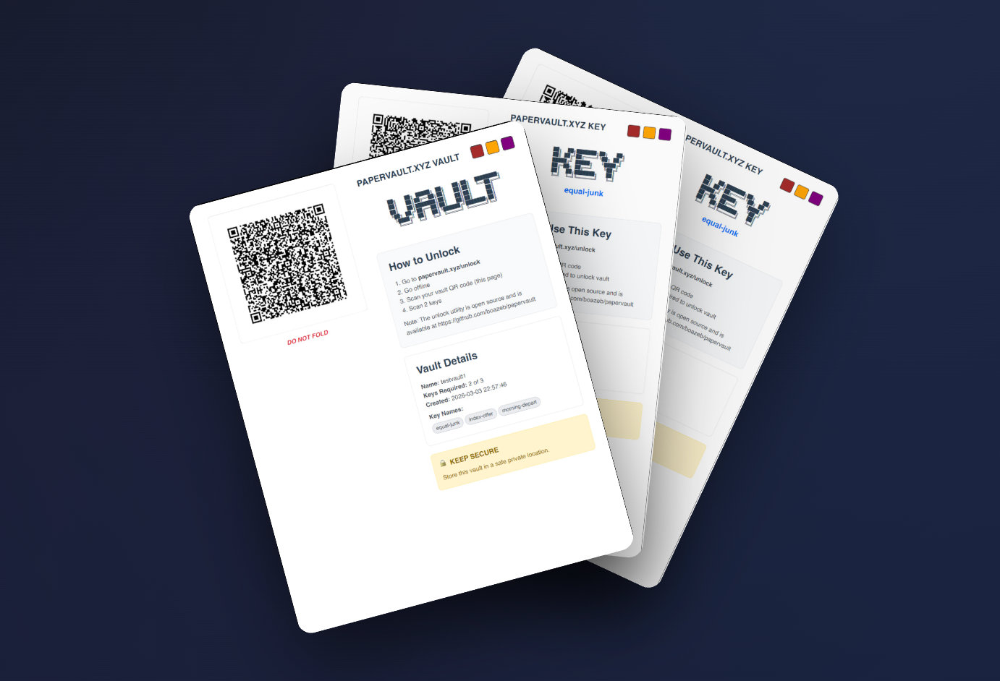

# PaperVault.xyz - Cold storage paper vault for passwords and digital assets

[](https://choosealicense.com/licenses/mit/)


**PaperVault.xyz** is a free open source tool that lets you create secure paper-based cold storage vaults for your digital assets, passwords, 2FA recovery codes, and other critical data.



## 🔐 What is PaperVault.xyz?

PaperVault.xyz uses [Shamir's Secret Sharing](https://en.wikipedia.org/wiki/Shamir%27s_Secret_Sharing) to split your secrets into multiple paper keys with configurable thresholds. For example, you can create 5 keys where any 3 are needed to recover your secret (3-of-5 threshold).

### Key Features
- **🌐 Works Offline** - No internet connection required after installation
- **🔒 Client-Side Only** - No data ever leaves your device
- **📄 Paper-Based Security** - Print QR codes for offline storage
- **🔢 Flexible Thresholds** - Support for any M-of-N combination (up to 20 keys)
- **🖨️ Professional PDFs** - Generate printable vault and key backups
- **🔍 Fully Auditable** - Complete source code available for security review


## 🚀 Quick Start

### Online Version
Visit [papervault.xyz](https://papervault.xyz) or [app.papervault.xyz](https://app.papervault.xyz) to use PaperVault.xyz directly in your browser.

### Self-Hosted Installation (Recommended for Maximum Security)

```bash
# Clone the repository
git clone https://github.com/boazeb/papervault.git
cd papervault

# Install dependencies
npm install
# or
yarn install

# Start the development server
npm start
# or
yarn start
```

Open [http://localhost:3000](http://localhost:3000) in your browser. 


## 🛡️ Security Model

### Cryptographic Foundation
- **Algorithm**: Shamir's Secret Sharing over GF(2^8). Vaults use [shamir-secret-sharing](https://github.com/privy-io/shamir-secret-sharing).
- **Encryption**: AES-256-GCM (authenticated) for v2 vaults via the Web Crypto API; legacy v1 vaults use AES-256-CTR and remain supported for unlock.
- **Key Generation**: Cryptographically secure random number generation via `crypto.getRandomValues()` (Web Crypto API).
- **QR Codes**: Version 6-8 QR codes for optimal scanning reliability.

See [SECURITY.md](SECURITY.md) for detailed cryptographic details, vault versions, and vulnerability reporting.

### Security Best Practices
1. **Air-Gapped Usage**: Run PaperVault.xyz from an offline computer for maximum security
2. **Source Code Review**: Audit the code before using with critical secrets
3. **Physical Security**: Store paper keys in separate, secure locations
4. **Test Recovery**: Always test your recovery process 

### Threat Model

PaperVault.xyz does NOT protect against:
- ❌ Physical compromise of threshold number of keys
- ❌ Shoulder surfing during secret entry
- ❌ Malicious modifications to the source code
- ❌ Social engineering

## 📖 How It Works

1. **Create Vault**: Enter your secret data (passwords, seed phrases, etc.)
2. **Configure Shares**: Choose number of keys and recovery threshold
3. **Generate Keys**: Cryptographically split your decryption key using Shamir's algorithm
4. **Print & Distribute**: Generate vault backups and distribute keys securely
5. **Recovery**: Use any threshold number of keys to decrypt your vault


## 🔧 Technical Details

### Architecture
- **Frontend**: React 17 with Bootstrap UI
- **Cryptography**: JavaScript implementation of Shamir's Secret Sharing
- **PDF Generation**: React-PDF for document output
- **QR Codes**: Optimized for mobile scanning and printing
- **Storage**: Client-side only, no external dependencies

### Limits
- **Maximum Keys**: 20 (cryptographic library constraint)
- **Storage Limit**: 300 characters per vault (QR code optimization)


## 🤝 Contributing

We welcome contributions! Please see our [Contributing Guidelines](CONTRIBUTING.md) for details.

## 🔍 Security Audit

This is open source software. We encourage security researchers to review the cryptographic implementation and report security issues responsibly to [support@papervault.xyz](mailto:support@papervault.xyz).

## 📄 License

This project is licensed under the MIT License - see the [LICENSE](LICENSE) file for details.

## 🙏 Acknowledgments

- [Shamir's Secret Sharing](https://en.wikipedia.org/wiki/Shamir%27s_Secret_Sharing) algorithm by Adi Shamir
- [secrets.js](https://github.com/grempe/secrets.js) library for JavaScript implementation
- React and the open source community

## 📞 Support

- **Issues**: Report bugs via [GitHub Issues](https://github.com/boazeb/papervault/issues)
- **Discussions**: Join conversations in [GitHub Discussions](https://github.com/boazeb/papervault/discussions)
- **Email**: [support@papervault.xyz](mailto:support@papervault.xyz)

## ⚠️ Disclaimer

This software is provided "as is" without warranty. Users are responsible for:
- Verifying the security of their implementation
- Testing recovery procedures before relying on them
- Maintaining physical security of printed keys
- Understanding the cryptographic principles involved

**Always test with non-critical data first!**

---

**Made with ❤️ in Tel Aviv**
